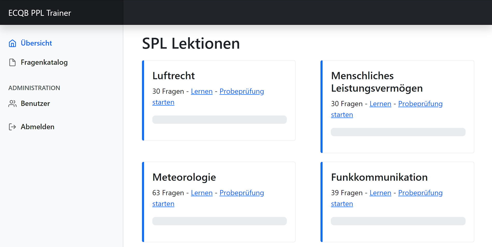

# ECQD PPL Trainer

* Self-hosted, open source, web-based training platform for theoretical questions pool of european private pilot licenses (ECQB).
* Multiple choice based quiz system.
* Every user has an account. The server supports unlimited users.
* Progress tracking for chapter, making progress visible.
* Server written in Python3 using Flask. Vue3 and Bootstrap5 used for frontend.

## Showcase


## Disclaimer
ECQB-PPL is an international question bank for private pilot licenses.\
Up to 75% of the exam questions are published publicly by EDUCADEMY GmbH.\
The question bank is protected by copyright and not included in this project.

## Getting Started
The project does not include the question bank, but you can download it from https://aeroclub.at/ for example.\
A script for the extraction of the questions and images is included in this project.

1. Make use python is installed. ```sudo apt install python3```
2. Install python requirements. ```pip install -r requirements.txt```
3. Download the ECQB-PPL files and copy them to [/sourcefiles](/sourcefiles) (names must match [/util-tools/import_ecqbppl.py](/util-tools/import_ecqbppl.py) script).
4. Run [/util-tools/import_ecqbppl.py](/util-tools/import_ecqbppl.py) to create [/database/questions.json](/database/questions.json) and [/database/images](/database/images).
5. The default user's username is "admin", password is "password". Change the default user's password in [/database/users.json](/database/users.json) by using [/util-tools/hash_password.py](/util-tools/hash_password.py) tool.
6. Change the SecretKey in [config.ini](config.ini).
7. Start the server. ```python3 app.py```

## Known Limitations
* The current implementation only contains the glider pilots license questions.
* Currently, the project's language is German. No translation library used.
* No user registration is planned.
* Passwords / usernames / question progress can only be edited in the database files.
